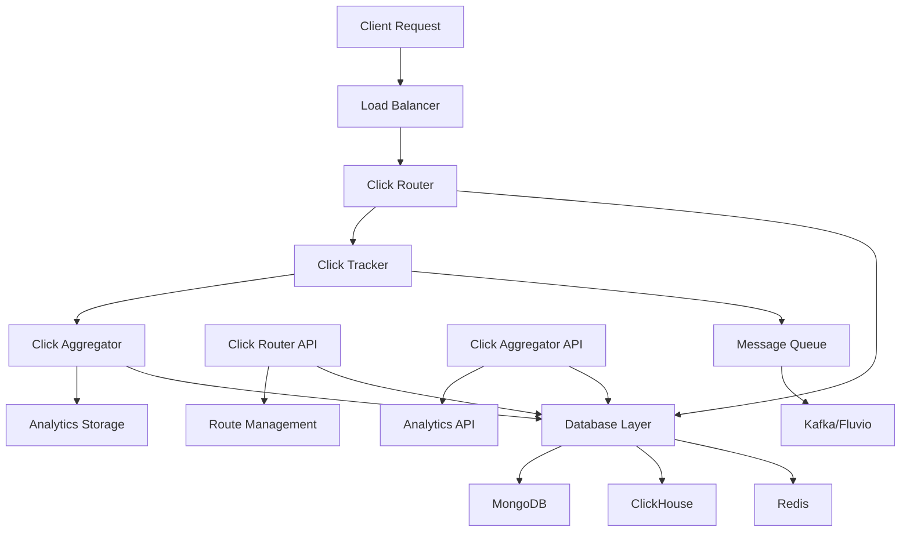
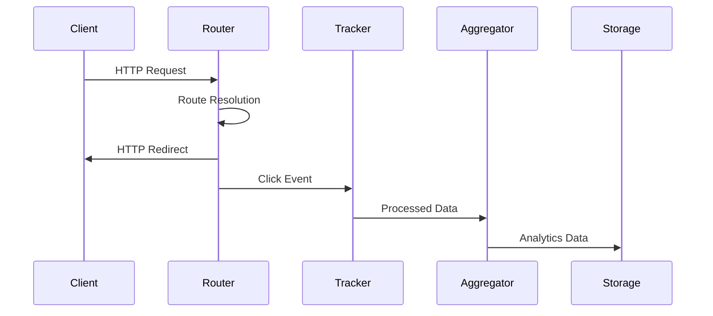
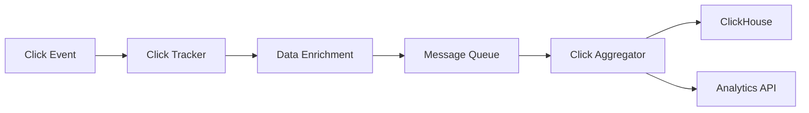
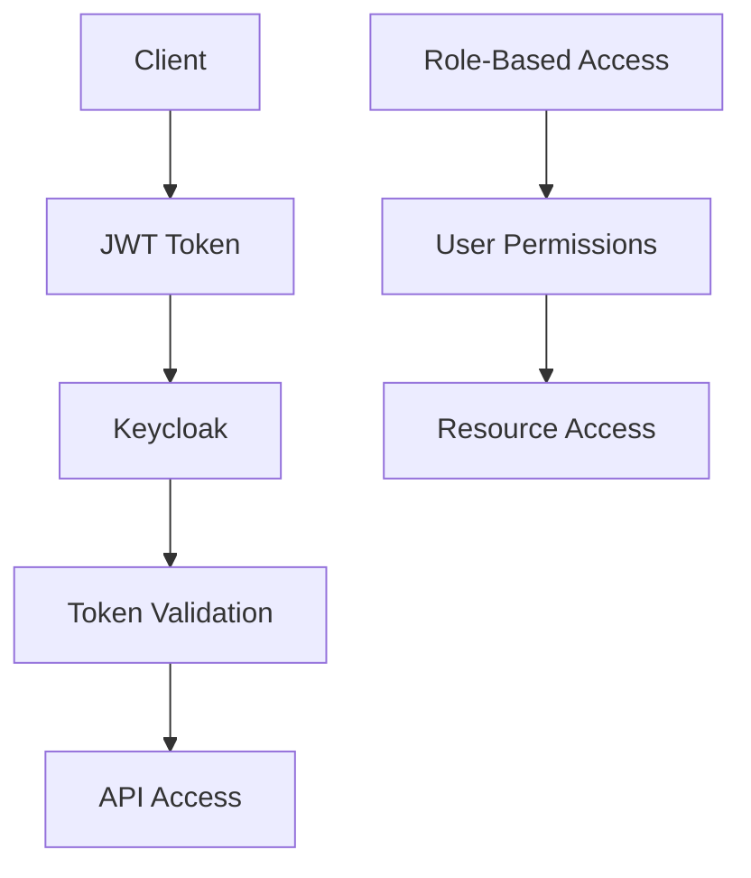
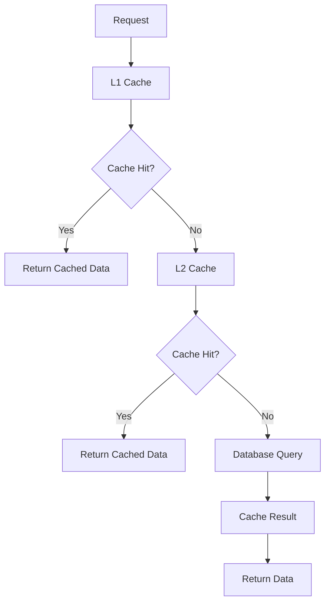
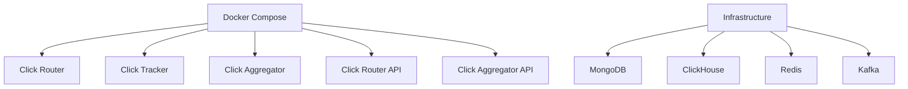
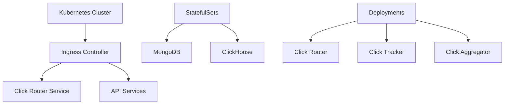
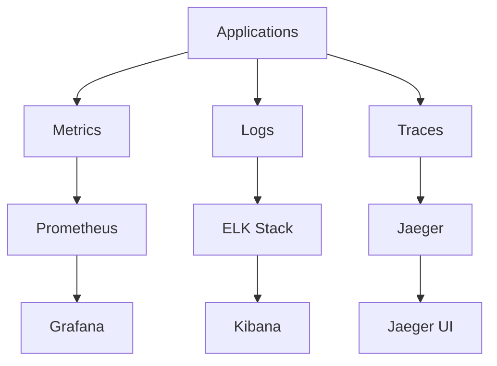
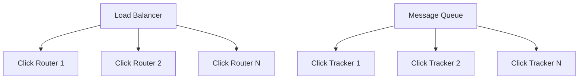
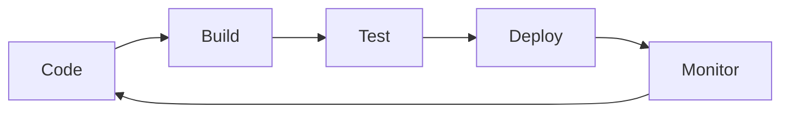

# Architecture Overview

Shortas is built as a microservices architecture designed for high performance, scalability, and reliability. This document provides a comprehensive overview of the system architecture.

## 🏗️ System Architecture

### High-Level Overview



### Core Components

Shortas consists of five main microservices:

1. **[Click Router](microservices/click-router/)** - Main redirect service
2. **[Click Tracker](microservices/click-tracker/)** - Real-time click processing
3. **[Click Aggregator](microservices/click-aggregator/)** - Analytics data processing
4. **[Click Router API](microservices/click-router-api/)** - Route management API
5. **[Click Aggregator API](microservices/click-aggregator-api/)** - Analytics API

## 🔄 Data Flow

### Request Processing Flow



### Analytics Flow



## 🧩 Microservices Architecture

### Click Router

**Purpose**: Main redirect service handling URL routing and redirects

**Key Features**:
- High-performance request routing
- Conditional routing based on user characteristics
- SSL certificate management
- Multi-database support (MongoDB, DynamoDB)
- Advanced caching with TTL

**Technology Stack**:
- Rust with Salvo web framework
- Async/await architecture
- Moka caching
- MongoDB/DynamoDB integration

### Click Tracker

**Purpose**: Real-time click processing and data enrichment

**Key Features**:
- Real-time click tracking
- Geographic data enrichment
- Device and browser analytics
- Bot detection and filtering
- Session tracking

**Technology Stack**:
- Rust with async processing
- GeoIP database integration
- User agent parsing
- Kafka/Fluvio streaming

### Click Aggregator

**Purpose**: Analytics data processing and storage

**Key Features**:
- Batch processing of click data
- Data aggregation and summarization
- ClickHouse integration
- Real-time analytics
- Historical data processing

**Technology Stack**:
- Rust with batch processing
- ClickHouse for OLAP
- Kafka/Fluvio consumption
- Data compression and optimization

### Click Router API

**Purpose**: REST API for route and settings management

**Key Features**:
- CRUD operations for routes
- SSL certificate management
- User settings management
- JWT authentication
- OpenAPI documentation

**Technology Stack**:
- Rust with Salvo
- JWT authentication
- OpenAPI/Swagger integration
- MongoDB/DynamoDB integration

### Click Aggregator API

**Purpose**: Analytics and reporting API

**Key Features**:
- Click stream analytics
- Route-specific analytics
- Aggregated statistics
- Real-time metrics
- Historical reporting

**Technology Stack**:
- Rust with Salvo
- ClickHouse integration
- JWT authentication
- Real-time data processing

## 🗄️ Data Architecture

### Database Layer

#### MongoDB
- **Purpose**: Primary document storage
- **Collections**: Routes, user settings, certificates
- **Features**: High availability, horizontal scaling
- **Use Cases**: Route management, user data, configuration

#### ClickHouse
- **Purpose**: Analytics and OLAP database
- **Tables**: Click stream data, aggregated metrics
- **Features**: Columnar storage, fast aggregations
- **Use Cases**: Analytics, reporting, data warehousing

#### Redis
- **Purpose**: Caching and session storage
- **Features**: In-memory storage, high performance
- **Use Cases**: Route caching, session management, rate limiting

### Message Queue Layer

#### Apache Kafka
- **Purpose**: Distributed streaming platform
- **Topics**: Hit stream, analytics events
- **Features**: High throughput, fault tolerance
- **Use Cases**: Real-time data streaming, event processing

#### Fluvio
- **Purpose**: Modern streaming platform
- **Topics**: Hit stream, analytics events
- **Features**: Cloud-native, easy management
- **Use Cases**: Real-time analytics, event streaming

## 🔒 Security Architecture

### Authentication & Authorization



### Security Features

- **JWT Authentication**: Secure token-based authentication
- **Role-Based Access Control**: Fine-grained permissions
- **Rate Limiting**: Protection against abuse
- **Input Validation**: Comprehensive request validation
- **Security Headers**: Automatic security header injection
- **TLS/SSL**: End-to-end encryption

## 📊 Performance Architecture

### Caching Strategy



### Performance Optimizations

- **Multi-Level Caching**: L1 (Moka), L2 (Redis), L3 (Database)
- **Connection Pooling**: Efficient database connections
- **Async Processing**: Non-blocking I/O operations
- **Batch Processing**: Efficient data processing
- **Compression**: Data compression for storage and transmission

## 🌐 Deployment Architecture

### Container Architecture



### Kubernetes Architecture



## 🔧 Configuration Architecture

### Environment-Based Configuration

```toml
# Base configuration
[default]
server.threads = 8
database.url = "mongodb://localhost:27017/"

# Environment-specific overrides
[development]
server.threads = 4
debug.enabled = true

[production]
server.threads = 16
debug.enabled = false
```

### Service Discovery

- **Consul**: Service discovery and configuration
- **Kubernetes**: Native service discovery
- **Docker Compose**: Service networking
- **Load Balancers**: Traffic distribution

## 📈 Monitoring Architecture

### Observability Stack



### Monitoring Components

- **Prometheus**: Metrics collection and storage
- **Grafana**: Metrics visualization and dashboards
- **ELK Stack**: Log aggregation and analysis
- **Jaeger**: Distributed tracing
- **Health Checks**: Service health monitoring

## 🔄 Scalability Architecture

### Horizontal Scaling



### Auto-Scaling

- **Kubernetes HPA**: Horizontal Pod Autoscaler
- **Kubernetes VPA**: Vertical Pod Autoscaler
- **Custom Metrics**: Application-specific scaling
- **Load Testing**: Performance validation

## 🚀 Development Architecture

### Development Workflow



### CI/CD Pipeline

- **GitHub Actions**: Continuous integration
- **Docker**: Containerization
- **Kubernetes**: Deployment
- **Monitoring**: Health checks and alerts

## 📚 Additional Resources

- [Microservices Details](microservices/) - Detailed microservice documentation
- [Data Flow](data-flow/) - Data flow patterns and processing
- [Security](security/) - Security architecture and implementation
- [Deployment](../deployment/) - Deployment strategies and configurations

---

**Need more details?** Check out our [microservices documentation](microservices/) or [deployment guide](../deployment/).
