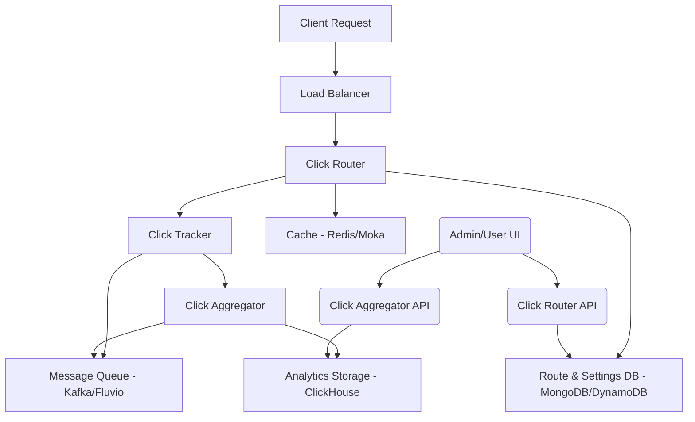

<div class="hero-section">
  <h1>Architecture Overview</h1>
  <p class="lead">Shortas is built as a microservices architecture designed for high performance, scalability, and reliability. This document provides a comprehensive overview of the system architecture.</p>
</div>

## 🏗️ System Architecture

### High-Level Overview



## 🧩 Core Microservices

Shortas is built around five primary microservices:

### 1. Click Router
**Function**: A high-performance, intelligent URL redirection service built in Rust. Provides advanced routing capabilities with conditional logic, analytics, and multi-database support for enterprise-grade URL shortening and redirection services.

**Key Features**:
- **High-Performance Routing**: Async/await architecture for maximum throughput
- **Intelligent Redirection**: Conditional routing based on user characteristics
- **Analytics & Tracking**: Comprehensive hit tracking and user behavior analysis
- **Multi-Database Support**: MongoDB and DynamoDB integration
- **Advanced Caching**: Multi-level caching with TTL and invalidation
- **TLS Support**: Custom certificate management for HTTPS

**Advanced Routing**:
- **Conditional Routing**: Route users based on:
  - User Agent (Browser, OS, Device)
  - Geographic Location (Country-based routing)
  - Time-based conditions
  - Custom expressions
- **Multiple Routing Policies**:
  - Basic routing
  - Conditional routing with complex expressions
  - Challenge-based routing
  - File serving
  - Mirroring
- **A/B Testing**: Built-in support for traffic splitting

**Technologies**: Rust, Salvo, MongoDB/DynamoDB, Moka (in-memory cache), Kafka/Fluvio, GeoIP, UA Parser.

### 2. Click Tracker
**Function**: Processes and enriches click event data in real-time. It captures details like user agent, IP address, geographic location, and device information.

**Key Features**:
- Real-time data enrichment
- Bot detection
- Unique visitor tracking
- Geographic analytics (country, continent, location)
- Device analytics (browser, OS, device tracking)
- Debug mode for development

**Technologies**: Rust, Kafka/Fluvio, GeoIP, UA Parser.

### 3. Click Aggregator
**Function**: Consumes enriched click data from the message queue, aggregates it, and stores it in the analytics database for reporting and analysis.

**Key Features**:
- Data aggregation
- OLAP storage
- Scalable data ingestion
- High-performance batch processing
- Analytics data processing and storage

**Technologies**: Rust, ClickHouse, Kafka/Fluvio.

### 4. Click Router API
**Function**: A high-performance, secure click aggregation API with JWT authentication via Keycloak, comprehensive OpenAPI documentation, and support for multiple database backends.

**Key Features**:
- **Route Management**: Complete CRUD operations for routing configurations
- **SSL Certificate Management**: Automated certificate handling with PEM encoding
- **User Settings**: Comprehensive user preference management
- **Bulk Operations**: Efficient batch processing for multiple resources
- **Security & Authentication**: JWT authentication, role-based access control, rate limiting
- **API Documentation**: OpenAPI 3.0 with Swagger UI

**Technologies**: Rust, Salvo, MongoDB/DynamoDB, Keycloak (for JWT).

### 5. Click Aggregator API
**Function**: A high-performance, secure click aggregation API with JWT authentication via Keycloak, comprehensive OpenAPI documentation, and ClickHouse integration for analytics.

**Key Features**:
- Analytics and reporting endpoints
- ClickHouse integration for analytics
- JWT authentication via Keycloak
- OpenAPI documentation
- High-performance data querying

**Technologies**: Rust, Salvo, ClickHouse, Keycloak (for JWT).

## 🏗️ Click Router Architecture

Click Router uses a modular, pipeline-based architecture:

```
Request → Flow Router → Modules → Adapters → Response
```

### Core Components

- **Flow Router**: Central request processing engine
- **Modules**: Pluggable processing steps (Root, Conditional, NotFound, etc.)
- **Adapters**: Service integrations (databases, caches, analytics)
- **Models**: Data structures for routes, hits, and settings

### Request Processing Pipeline

1. **Start**: Initial request processing and validation
2. **UrlExtract**: URL analysis and route matching
3. **Register**: Hit logging and analytics
4. **BuildResult**: Response generation
5. **End**: Final response processing

### Project Structure

```
src/
├── adapters/          # Service integrations
│   ├── aws/          # DynamoDB integration
│   ├── mongodb/      # MongoDB integration
│   ├── moka/         # Caching layer
│   └── fluvio/       # Analytics streaming
├── core/             # Core routing logic
│   ├── flow_router.rs # Main router
│   └── modules/      # Processing modules
├── model/            # Data models
└── settings.rs       # Configuration
```

## 🔄 Data Flow

The data flow within Shortas is designed for high throughput and real-time processing:

1.  **Incoming Request**: A user clicks a short URL, sending an HTTP request to the **Click Router**.
2.  **Route Resolution**: The Click Router resolves the short URL to its long destination, potentially applying conditional logic based on request parameters (e.g., user agent, geo-location). It queries MongoDB/DynamoDB for route information, utilizing Redis/Moka for caching.
3.  **Hit Tracking**: Before redirection, the Click Router sends a raw click event to the **Click Tracker** via a message queue (Kafka/Fluvio).
4.  **Data Enrichment**: The Click Tracker enriches the raw click event with additional metadata (e.g., device type, OS, browser, country from GeoIP/UA Parser) and publishes the enriched event back to the message queue.
5.  **Data Aggregation**: The **Click Aggregator** consumes the enriched click events from the message queue, performs necessary aggregations, and stores the data in ClickHouse.
6.  **Redirection**: The Click Router issues an HTTP redirect (301, 302, etc.) to the user's browser, sending them to the long destination URL.
7.  **API Access**:
    -   The **Click Router API** is used by administrators or user interfaces to create, update, or delete short URLs and manage settings.
    -   The **Click Aggregator API** is used to retrieve analytics reports and raw click stream data from ClickHouse.

## 🗄️ Data Storage and Caching

-   **MongoDB / AWS DynamoDB**: Primary databases for storing route configurations, user settings, and SSL certificates. Chosen for their flexibility and scalability.
-   **ClickHouse**: An analytical column-oriented database used for storing and querying large volumes of click stream data. Optimized for OLAP queries.
-   **Redis**: Used for distributed caching of frequently accessed data (e.g., session data, hot routes) and potentially for rate limiting.
-   **Moka**: An in-memory cache used within individual services (like Click Router) for very fast access to hot routes and other critical data.

## 🌐 Network and Communication

-   **HTTP/HTTPS**: All external and internal API communication uses HTTP/HTTPS.
-   **Apache Kafka / Fluvio**: Distributed streaming platforms for high-throughput, low-latency communication between Click Router, Click Tracker, and Click Aggregator. This ensures reliable event delivery and decouples services.

## 🔒 Security Considerations

-   **JWT Authentication**: Used for securing API endpoints, typically integrated with an identity provider like Keycloak.
-   **Role-Based Access Control (RBAC)**: Ensures users only access resources they are authorized for.
-   **Input Validation**: Prevents common web vulnerabilities like injection attacks.
-   **Rate Limiting**: Protects against abuse and DDoS attacks.
-   **TLS/SSL**: Encrypts all data in transit.

---

**Next Steps**: Explore the [API Reference](/api/) for detailed information on interacting with Shortas services.
