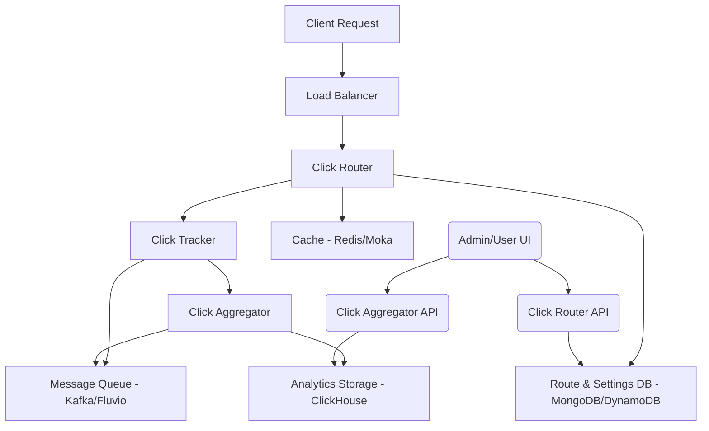

  <h1>Architecture Overview</h1>
  
Shortas is built as a microservices architecture designed for high performance, scalability, and reliability. This document provides a comprehensive overview of the system architecture.

## 🏗️ System Architecture

### High-Level Overview

## 🧩 Core Microservices

Shortas is built around five primary microservices:

1.  **Click Router**:
    -   **Function**: The main service responsible for handling incoming short URL requests, resolving them to their long destinations, and performing the actual HTTP redirection.
    -   **Key Features**: High-performance routing, conditional redirects (based on device, geo-location, time), A/B testing, SSL certificate management.
    -   **Technologies**: Rust, Salvo, MongoDB/DynamoDB, Moka (in-memory cache).

2.  **Click Tracker**:
    -   **Function**: Processes and enriches click event data in real-time. It captures details like user agent, IP address, geographic location, and device information.
    -   **Key Features**: Real-time data enrichment, bot detection, unique visitor tracking.
    -   **Technologies**: Rust, Kafka/Fluvio, GeoIP, UA Parser.

3.  **Click Aggregator**:
    -   **Function**: Consumes enriched click data from the message queue, aggregates it, and stores it in the analytics database for reporting and analysis.
    -   **Key Features**: Data aggregation, OLAP storage, scalable data ingestion.
    -   **Technologies**: Rust, ClickHouse, Kafka/Fluvio.

4.  **Click Router API**:
    -   **Function**: Provides a RESTful interface for managing routing configurations, SSL certificates, and user-specific settings. This API is used by administrative tools and user interfaces.
    -   **Key Features**: CRUD operations for routes, JWT authentication, OpenAPI documentation.
    -   **Technologies**: Rust, Salvo, MongoDB/DynamoDB, Keycloak (for JWT).

5.  **Click Aggregator API**:
    -   **Function**: Offers a RESTful interface for querying and retrieving aggregated analytics data and raw click stream data.
    -   **Key Features**: Analytics reporting, click stream access, JWT authentication, OpenAPI documentation.
    -   **Technologies**: Rust, Salvo, ClickHouse, Keycloak (for JWT).

## 🔄 Data Flow

The data flow within Shortas is designed for high throughput and real-time processing:

1.  **Incoming Request**: A user clicks a short URL, sending an HTTP request to the **Click Router**.
2.  **Route Resolution**: The Click Router resolves the short URL to its long destination, potentially applying conditional logic based on request parameters (e.g., user agent, geo-location). It queries MongoDB/DynamoDB for route information, utilizing Redis/Moka for caching.
3.  **Hit Tracking**: Before redirection, the Click Router sends a raw click event to the **Click Tracker** via a message queue (Kafka/Fluvio).
4.  **Data Enrichment**: The Click Tracker enriches the raw click event with additional metadata (e.g., device type, OS, browser, country from GeoIP/UA Parser) and publishes the enriched event back to the message queue.
5.  **Data Aggregation**: The **Click Aggregator** consumes the enriched click events from the message queue, performs necessary aggregations, and stores the data in ClickHouse.
6.  **Redirection**: The Click Router issues an HTTP redirect (301, 302, etc.) to the user's browser, sending them to the long destination URL.
7.  **API Access**:
    -   The **Click Router API** is used by administrators or user interfaces to create, update, or delete short URLs and manage settings.
    -   The **Click Aggregator API** is used to retrieve analytics reports and raw click stream data from ClickHouse.

## 🗄️ Data Storage and Caching

-   **MongoDB / AWS DynamoDB**: Primary databases for storing route configurations, user settings, and SSL certificates. Chosen for their flexibility and scalability.
-   **ClickHouse**: An analytical column-oriented database used for storing and querying large volumes of click stream data. Optimized for OLAP queries.
-   **Redis**: Used for distributed caching of frequently accessed data (e.g., session data, hot routes) and potentially for rate limiting.
-   **Moka**: An in-memory cache used within individual services (like Click Router) for very fast access to hot routes and other critical data.

## 🌐 Network and Communication

-   **HTTP/HTTPS**: All external and internal API communication uses HTTP/HTTPS.
-   **Apache Kafka / Fluvio**: Distributed streaming platforms for high-throughput, low-latency communication between Click Router, Click Tracker, and Click Aggregator. This ensures reliable event delivery and decouples services.

## 🔒 Security Considerations

-   **JWT Authentication**: Used for securing API endpoints, typically integrated with an identity provider like Keycloak.
-   **Role-Based Access Control (RBAC)**: Ensures users only access resources they are authorized for.
-   **Input Validation**: Prevents common web vulnerabilities like injection attacks.
-   **Rate Limiting**: Protects against abuse and DDoS attacks.
-   **TLS/SSL**: Encrypts all data in transit.

---

**Next Steps**: Explore the [API Reference](/api/) for detailed information on interacting with Shortas services.
