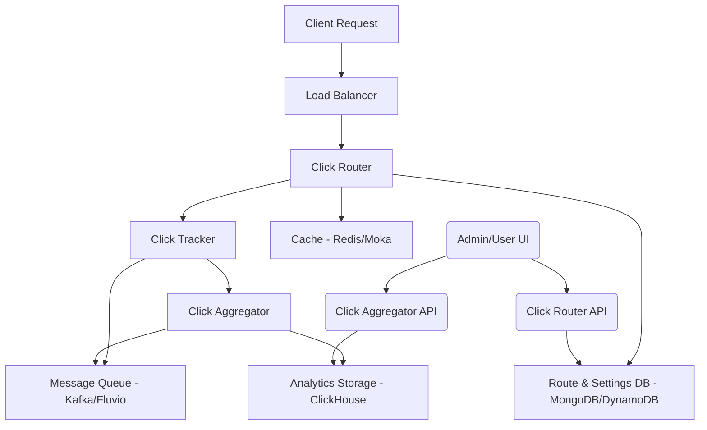

<div class="hero-section">
  <h1>Architecture Overview</h1>
  <p class="lead">Shortas is built as a microservices architecture designed for high performance, scalability, and reliability. This document provides a comprehensive overview of the system architecture, data flow, and component interactions.</p>
</div>

## 🏗️ System Architecture

### High-Level Overview

<div class="card">
  <div class="card-header">Architecture Diagram</div>
  <p>The following diagram illustrates the high-level architecture of Shortas:</p>
</div>



## 🧩 Core Microservices

Shortas is built around five primary microservices, each optimized for specific responsibilities:

<div class="feature-grid">
  <div class="card">
    <div class="card-header">1. Click Router 🚀</div>
    <p><strong>Function:</strong> A high-performance, intelligent URL redirection service built in Rust. Provides advanced routing capabilities with conditional logic, analytics, and multi-database support for enterprise-grade URL shortening and redirection services.</p>
    
    <h4>Key Features</h4>
    <ul>
      <li><strong>High-Performance Routing:</strong> Async/await architecture for maximum throughput</li>
      <li><strong>Intelligent Redirection:</strong> Conditional routing based on user characteristics</li>
      <li><strong>Analytics & Tracking:</strong> Comprehensive hit tracking and user behavior analysis</li>
      <li><strong>Multi-Database Support:</strong> MongoDB and DynamoDB integration</li>
      <li><strong>Advanced Caching:</strong> Multi-level caching with TTL and invalidation</li>
      <li><strong>TLS Support:</strong> Custom certificate management for HTTPS</li>
    </ul>
    
    <h4>Advanced Routing</h4>
    <ul>
      <li><strong>Conditional Routing:</strong> Route users based on:
        <ul>
          <li>User Agent (Browser, OS, Device)</li>
          <li>Geographic Location (Country-based routing)</li>
          <li>Time-based conditions</li>
          <li>Custom expressions</li>
        </ul>
      </li>
      <li><strong>Multiple Routing Policies:</strong>
        <ul>
          <li>Basic routing</li>
          <li>Conditional routing with complex expressions</li>
          <li>Challenge-based routing</li>
          <li>File serving</li>
          <li>Mirroring</li>
        </ul>
      </li>
      <li><strong>A/B Testing:</strong> Built-in support for traffic splitting</li>
    </ul>
    
    <p><strong>Technologies:</strong> Rust, Salvo, MongoDB/DynamoDB, Moka (in-memory cache), Kafka/Fluvio, GeoIP, UA Parser.</p>
    <p><strong>Performance:</strong> 360,000+ requests/second (CPU-only), 2.6-2.8 µs latency per redirect</p>
  </div>
  
  <div class="card">
    <div class="card-header">2. Click Tracker 📊</div>
    <p><strong>Function:</strong> Processes and enriches click event data in real-time. It captures details like user agent, IP address, geographic location, and device information.</p>
    
    <h4>Key Features</h4>
    <ul>
      <li>Real-time data enrichment</li>
      <li>Bot detection</li>
      <li>Unique visitor tracking</li>
      <li>Geographic analytics (country, continent, location)</li>
      <li>Device analytics (browser, OS, device tracking)</li>
      <li>Debug mode for development</li>
    </ul>
    
    <p><strong>Technologies:</strong> Rust, Kafka/Fluvio, GeoIP, UA Parser.</p>
    <p><strong>Performance:</strong> 1.07 Million events/second (CPU-only), 927 ns latency. Real-world with I/O: ~7,800 events/sec (8 workers)</p>
  </div>
  
  <div class="card">
    <div class="card-header">3. Click Aggregator ⚡</div>
    <p><strong>Function:</strong> Consumes enriched click data from the message queue, aggregates it, and stores it in the analytics database for reporting and analysis.</p>
    
    <h4>Key Features</h4>
    <ul>
      <li>Data aggregation</li>
      <li>OLAP storage</li>
      <li>Scalable data ingestion</li>
      <li>High-performance batch processing</li>
      <li>Analytics data processing and storage</li>
    </ul>
    
    <p><strong>Technologies:</strong> Rust, ClickHouse, Kafka/Fluvio.</p>
    <p><strong>Performance:</strong> 1.05 Million records/second (CPU-only), ~950 ns latency for conversions</p>
  </div>
  
  <div class="card">
    <div class="card-header">4. Click Router API 🔧</div>
    <p><strong>Function:</strong> A high-performance, secure click aggregation API with JWT authentication via Keycloak, comprehensive OpenAPI documentation, and support for multiple database backends.</p>
    
    <h4>Key Features</h4>
    <ul>
      <li><strong>Route Management:</strong> Complete CRUD operations for routing configurations</li>
      <li><strong>SSL Certificate Management:</strong> Automated certificate handling with PEM encoding</li>
      <li><strong>User Settings:</strong> Comprehensive user preference management</li>
      <li><strong>Bulk Operations:</strong> Efficient batch processing for multiple resources</li>
      <li><strong>Security & Authentication:</strong> JWT authentication, role-based access control, rate limiting</li>
      <li><strong>API Documentation:</strong> OpenAPI 3.0 with Swagger UI</li>
    </ul>
    
    <p><strong>Technologies:</strong> Rust, Salvo, MongoDB/DynamoDB, Keycloak (for JWT).</p>
    <p><strong>Performance:</strong> 5,000+ requests/second</p>
  </div>
  
  <div class="card">
    <div class="card-header">5. Click Aggregator API 📈</div>
    <p><strong>Function:</strong> A high-performance, secure click aggregation API with JWT authentication via Keycloak, comprehensive OpenAPI documentation, and ClickHouse integration for analytics.</p>
    
    <h4>Key Features</h4>
    <ul>
      <li>Analytics and reporting endpoints</li>
      <li>ClickHouse integration for analytics</li>
      <li>JWT authentication via Keycloak</li>
      <li>OpenAPI documentation</li>
      <li>High-performance data querying</li>
    </ul>
    
    <p><strong>Technologies:</strong> Rust, Salvo, ClickHouse, Keycloak (for JWT).</p>
    <p><strong>Performance:</strong> 5,000+ requests/second</p>
  </div>
</div>

## 🏗️ Click Router Architecture

Click Router uses a modular, pipeline-based architecture:

```
Request → Flow Router → Modules → Adapters → Response
```

### Core Components

<div class="card">
  <div class="card-header">Component Breakdown</div>
  <ul>
    <li><strong>Flow Router:</strong> Central request processing engine</li>
    <li><strong>Modules:</strong> Pluggable processing steps (Root, Conditional, NotFound, etc.)</li>
    <li><strong>Adapters:</strong> Service integrations (databases, caches, analytics)</li>
    <li><strong>Models:</strong> Data structures for routes, hits, and settings</li>
  </ul>
</div>

### Request Processing Pipeline

<div class="card">
  <div class="card-header">Processing Steps</div>
  <ol>
    <li><strong>Start:</strong> Initial request processing and validation</li>
    <li><strong>UrlExtract:</strong> URL analysis and route matching</li>
    <li><strong>Register:</strong> Hit logging and analytics</li>
    <li><strong>BuildResult:</strong> Response generation</li>
    <li><strong>End:</strong> Final response processing</li>
  </ol>
</div>

### Project Structure

```
src/
├── adapters/          # Service integrations
│   ├── aws/          # DynamoDB integration
│   ├── mongodb/      # MongoDB integration
│   ├── moka/         # Caching layer
│   └── fluvio/       # Analytics streaming
├── core/             # Core routing logic
│   ├── flow_router.rs # Main router
│   └── modules/      # Processing modules
├── model/            # Data models
└── settings.rs       # Configuration
```

## 🔄 Data Flow

The data flow within Shortas is designed for high throughput and real-time processing:

<div class="card">
  <div class="card-header">Data Flow Process</div>
  <ol>
    <li><strong>Incoming Request:</strong> A user clicks a short URL, sending an HTTP request to the <strong>Click Router</strong>.</li>
    <li><strong>Route Resolution:</strong> The Click Router resolves the short URL to its long destination, potentially applying conditional logic based on request parameters (e.g., user agent, geo-location). It queries MongoDB/DynamoDB for route information, utilizing Redis/Moka for caching.</li>
    <li><strong>Hit Tracking:</strong> Before redirection, the Click Router sends a raw click event to the <strong>Click Tracker</strong> via a message queue (Kafka/Fluvio).</li>
    <li><strong>Data Enrichment:</strong> The Click Tracker enriches the raw click event with additional metadata (e.g., device type, OS, browser, country from GeoIP/UA Parser) and publishes the enriched event back to the message queue.</li>
    <li><strong>Data Aggregation:</strong> The <strong>Click Aggregator</strong> consumes the enriched click events from the message queue, performs necessary aggregations, and stores the data in ClickHouse.</li>
    <li><strong>Redirection:</strong> The Click Router issues an HTTP redirect (301, 302, etc.) to the user's browser, sending them to the long destination URL.</li>
    <li><strong>API Access:</strong>
      <ul>
        <li>The <strong>Click Router API</strong> is used by administrators or user interfaces to create, update, or delete short URLs and manage settings.</li>
        <li>The <strong>Click Aggregator API</strong> is used to retrieve analytics reports and raw click stream data from ClickHouse.</li>
      </ul>
    </li>
  </ol>
</div>

## 🗄️ Data Storage and Caching

<div class="feature-grid">
  <div class="card">
    <div class="card-header">MongoDB / AWS DynamoDB</div>
    <p>Primary databases for storing route configurations, user settings, and SSL certificates. Chosen for their flexibility and scalability.</p>
    <ul>
      <li><strong>Use Cases:</strong> Route configurations, user settings, SSL certificates</li>
      <li><strong>Benefits:</strong> Flexible schema, horizontal scaling</li>
    </ul>
  </div>
  
  <div class="card">
    <div class="card-header">ClickHouse</div>
    <p>An analytical column-oriented database used for storing and querying large volumes of click stream data. Optimized for OLAP queries.</p>
    <ul>
      <li><strong>Use Cases:</strong> Click stream analytics, aggregations, reporting</li>
      <li><strong>Benefits:</strong> High-performance OLAP, columnar storage</li>
    </ul>
  </div>
  
  <div class="card">
    <div class="card-header">Redis</div>
    <p>Used for distributed caching of frequently accessed data (e.g., session data, hot routes) and potentially for rate limiting.</p>
    <ul>
      <li><strong>Use Cases:</strong> Route caching, session storage, rate limiting</li>
      <li><strong>Benefits:</strong> Low latency, high throughput</li>
    </ul>
  </div>
  
  <div class="card">
    <div class="card-header">Moka</div>
    <p>An in-memory cache used within individual services (like Click Router) for very fast access to hot routes and other critical data.</p>
    <ul>
      <li><strong>Use Cases:</strong> In-process caching, hot route storage</li>
      <li><strong>Benefits:</strong> Zero latency, no network overhead</li>
    </ul>
  </div>
</div>

## 🌐 Network and Communication

<div class="card">
  <div class="card-header">Communication Protocols</div>
  <ul>
    <li><strong>HTTP/HTTPS:</strong> All external and internal API communication uses HTTP/HTTPS.</li>
    <li><strong>Apache Kafka / Fluvio:</strong> Distributed streaming platforms for high-throughput, low-latency communication between Click Router, Click Tracker, and Click Aggregator. This ensures reliable event delivery and decouples services.</li>
  </ul>
</div>

## 🔒 Security Considerations

<div class="card">
  <div class="card-header">Security Features</div>
  <ul>
    <li><strong>JWT Authentication:</strong> Used for securing API endpoints, typically integrated with an identity provider like Keycloak.</li>
    <li><strong>Role-Based Access Control (RBAC):</strong> Ensures users only access resources they are authorized for.</li>
    <li><strong>Input Validation:</strong> Prevents common web vulnerabilities like injection attacks.</li>
    <li><strong>Rate Limiting:</strong> Protects against abuse and DDoS attacks.</li>
    <li><strong>TLS/SSL:</strong> Encrypts all data in transit.</li>
  </ul>
</div>

## 📊 Performance Characteristics

<div class="alert alert-info">
  <strong>Note:</strong> CPU-only benchmarks measure pure processing speed. Real-world throughput with I/O (Redis, Kafka, ClickHouse) varies by workload but typically achieves 4,000-10,000 events/sec per worker.
</div>

<div class="card">
  <div class="card-header">Performance Metrics (Based on Actual Benchmarks)</div>
  <table>
    <tr>
      <th>Service</th>
      <th>Throughput</th>
      <th>Latency</th>
    </tr>
    <tr>
      <td>Click Router</td>
      <td>360,000+ req/s</td>
      <td>2.6-2.8 µs (CPU-only)</td>
    </tr>
    <tr>
      <td>Click Tracker</td>
      <td>1.07M events/s</td>
      <td>927 ns (CPU), 7,800/s with I/O</td>
    </tr>
    <tr>
      <td>Click Aggregator</td>
      <td>1.05M records/s</td>
      <td>~950 ns (CPU-only)</td>
    </tr>
    <tr>
      <td>Click Router API</td>
      <td>5,000+ req/s</td>
      <td>&lt;5ms (prod estimate)</td>
    </tr>
    <tr>
      <td>Click Aggregator API</td>
      <td>5,000+ req/s</td>
      <td>&lt;5ms (prod estimate)</td>
    </tr>
  </table>
</div>

---

**Next Steps**: Explore the [API Reference](/api/) for detailed information on interacting with Shortas services, or check out the [Deployment Guide](/deployment/) to learn about deploying Shortas in production.
