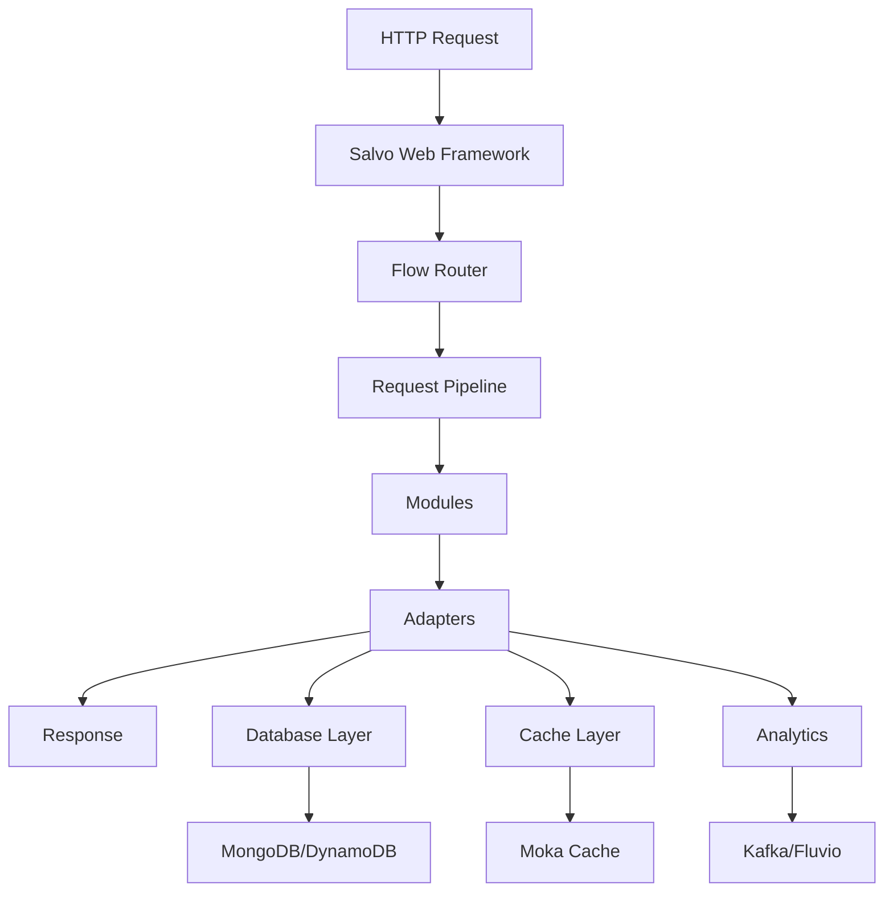
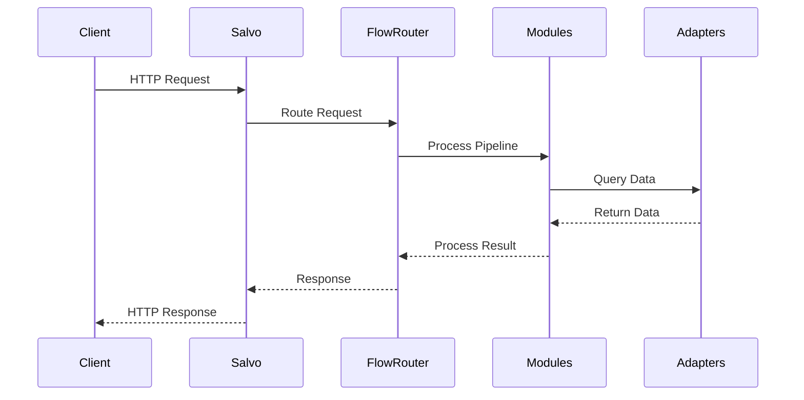
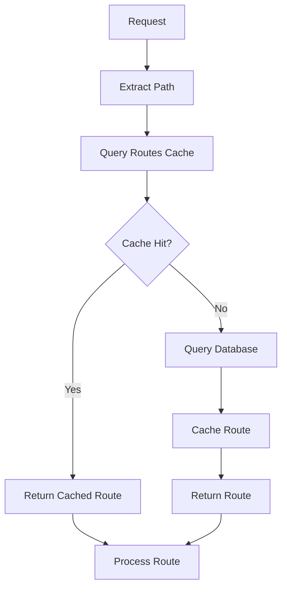
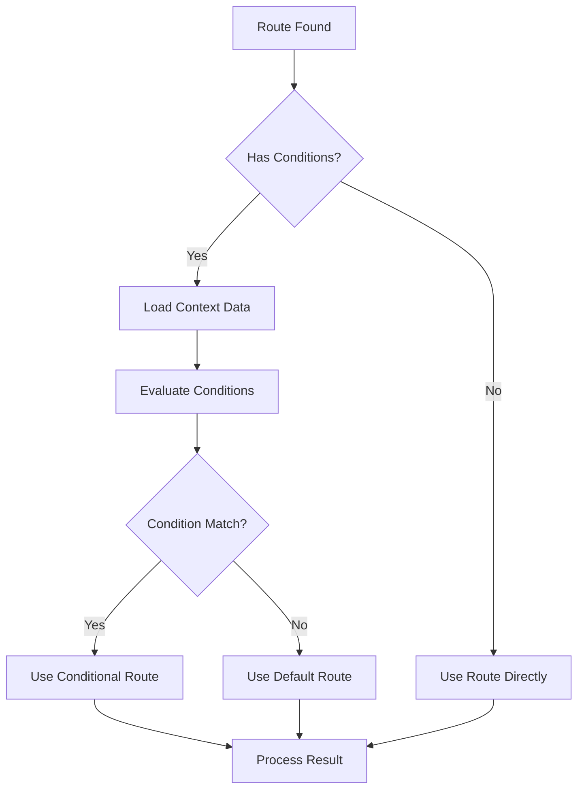

# Click Router Architecture

This document provides a detailed overview of the Click Router architecture, including design patterns, component interactions, and system flow.

## 🏗️ System Overview

Click Router is built using a **modular, pipeline-based architecture** that processes HTTP requests through a series of configurable steps. The system is designed for high performance, scalability, and extensibility.

## 📊 High-Level Architecture



## 🔄 Request Processing Pipeline

### Flow Steps

The request processing follows a strict pipeline with these steps:

1. **Initial** → Request initialization
2. **Start** → Initial processing and validation
3. **UrlExtract** → URL analysis and route matching
4. **Register** → Hit logging and analytics
5. **BuildResult** → Response generation
6. **End** → Final response processing

### Flow Router Context

Each request is processed within a `FlowRouterContext` that contains:

```rust
pub struct FlowRouterContext {
    pub id: String,                    // Unique request ID
    pub utc: DateTime<Utc>,           // Request timestamp
    pub data: HashMap<&str, FlowRouterData>, // Context data
    pub current_step: FlowStep,        // Current processing step
    pub host: Option<HostInfo>,        // Host information
    pub client_ip: Option<IPInfo>,     // Client IP
    pub user_agent: Option<String>,    // User agent string
    pub client_langs: Option<Vec<Language>>, // Accept-Language
    pub protocol: Option<ProtoInfo>,   // Protocol information
    pub out_route: Option<Route>,      // Output route
    pub main_route: Option<Route>,     // Main route
    pub in_route: FlowInRoute,         // Input route
    pub request: &RequestType,         // Request wrapper
    pub response: &ResponseType,       // Response wrapper
    pub result: Option<FlowRouterResult>, // Final result
}
```

## 🧩 Core Components

### 1. Flow Router

The central orchestrator that manages the request processing pipeline.

**Responsibilities:**
- Request routing and processing
- Context management
- Module coordination
- Result generation

**Key Methods:**
- `handle()` - Main entry point
- `router_to()` - Step progression
- `get_route()` - Route retrieval
- `load_*()` - Lazy loading of context data

### 2. Modules

Pluggable components that process requests at different pipeline stages.

#### Available Modules

**Root Module**
- Handles root path requests (`/`)
- Proxies to index URL
- Sets root context flags

**Conditional Module**
- Evaluates conditional routing expressions
- Loads required context data (UA, OS, country)
- Matches conditions to routes

**NotFound Module**
- Handles 404 cases
- Provides fallback URLs
- Error handling

**RedirectOnly Module**
- Simple redirect functionality
- Basic URL redirection

#### Module Interface

```rust
#[async_trait]
pub trait FlowModule {
    async fn init(&self, context: &mut FlowRouterContext, router: &FlowRouter) -> Result<FlowStepContinuation>;
    async fn handle_start(&self, context: &mut FlowRouterContext, router: &FlowRouter) -> Result<FlowStepContinuation>;
    async fn handle_url_extract(&self, context: &mut FlowRouterContext, router: &FlowRouter) -> Result<FlowStepContinuation>;
    async fn handle_register(&self, context: &mut FlowRouterContext, router: &FlowRouter) -> Result<FlowStepContinuation>;
    async fn handle_build_result(&self, context: &mut FlowRouterContext, router: &FlowRouter) -> Result<FlowStepContinuation>;
    async fn handle_end(&self, context: &mut FlowRouterContext, router: &FlowRouter) -> Result<FlowStepContinuation>;
}
```

### 3. Adapters

Service integration layer that provides abstraction over external services.

#### Database Adapters

**MongoDB Adapter**
```rust
pub struct MongodbRoutesStore {
    collection: Collection<Route>,
    client: Client,
}
```

**DynamoDB Adapter**
```rust
pub struct DynamoRoutesStore {
    client: aws_sdk_dynamodb::Client,
    table_name: String,
}
```

#### Cache Adapters

**Moka Cache**
```rust
pub struct MokaRoutesCache {
    cache: Cache<String, Route>,
    store: RoutesStoreType,
}
```

#### Analytics Adapters

**Kafka Hit Registrar**
```rust
pub struct KafkaHitRegistrar {
    producer: FutureProducer,
    topic: String,
}
```

**Fluvio Hit Registrar**
```rust
pub struct FluvioHitRegistrar {
    producer: TopicProducer,
    topic: String,
}
```

### 4. Data Models

#### Route Model

```rust
pub struct Route {
    pub switch: String,           // Route identifier
    pub link: String,            // URL path
    pub dest: Option<String>,    // Destination URL
    pub dest_format: DestinationFormat, // Format type
    pub code: Option<u16>,       // HTTP status code
    pub ttl: Option<u128>,       // Time to live
    pub status: RouteStatus,     // Active/Blocked
    pub terminal: RoutingTerminal, // External/Internal/Middleware
    pub policy: RoutingPolicy,   // Routing rules
    pub properties: RouteProperties, // Metadata
}
```

#### Routing Policies

**Basic Routing**
```rust
pub enum RoutingPolicy {
    Basic,
    Conditional(Vec<ConditionalRouting>),
    Challenge(ChallengeRouting),
    File(FileRouting),
    Mirroring,
    Unknown,
}
```

**Conditional Routing**
```rust
pub struct ConditionalRouting {
    pub key: String,             // Route key
    pub condition: Expression,   // Condition expression
}
```

## 🔄 Data Flow

### 1. Request Arrival



### 2. Route Resolution



### 3. Conditional Processing



## 🗄️ Data Storage

### Database Schema

#### Routes Collection
```json
{
  "switch": "main",
  "link": "example",
  "dest": "https://example.com",
  "dest_format": "Http",
  "code": 302,
  "ttl": 3600,
  "status": "Active",
  "terminal": "External",
  "policy": {
    "type": "Conditional",
    "conditions": [...]
  },
  "properties": {
    "route_id": "route_123",
    "domain_id": "domain_456",
    "owner_id": "user_789",
    "allow_debug": true
  }
}
```

#### User Settings Collection
```json
{
  "user_id": "user_123",
  "settings": {
    "preferences": {...},
    "routing_rules": [...]
  }
}
```

### Caching Strategy

**Multi-Level Caching:**
1. **L1 Cache**: In-memory Moka cache
2. **L2 Cache**: Database query cache
3. **L3 Cache**: External cache (Redis, etc.)

**Cache Invalidation:**
- TTL-based expiration
- Manual invalidation
- Event-driven invalidation

## 🔧 Configuration Management

### Environment-Based Configuration

```toml
# Base configuration
[default]
server.threads = 8
server.listen_os_signals = true

# Environment-specific overrides
[development]
server.threads = 4
debug.enabled = true

[production]
server.threads = 16
debug.enabled = false
```

### Service Configuration

**Database Configuration:**
```toml
[mongodb]
uri = "mongodb://localhost:27017/"
database = "shortas"
routes_collection = "routes"

[aws.dynamo]
routes_table = "routes-table"
encryption_table = "encryption-table"
```

**Cache Configuration:**
```toml
[moka.routes_cache]
max_capacity = 10000
time_to_live_minutes = 60
time_to_idle_minutes = 20
```

## 🚀 Performance Optimizations

### Async Processing
- Full async/await architecture
- Non-blocking I/O operations
- Concurrent request handling

### Caching Strategy
- Multi-level caching
- Intelligent cache warming
- Cache invalidation strategies

### Database Optimization
- Connection pooling
- Query optimization
- Index strategies

### Memory Management
- Efficient data structures
- Lazy loading
- Memory pooling

## 🔒 Security Considerations

### Input Validation
- URL sanitization
- Parameter validation
- SQL injection prevention

### Authentication & Authorization
- Route-level permissions
- User authentication
- API key management

### TLS/SSL
- Custom certificate management
- TLS termination
- Secure headers

## 📊 Monitoring & Observability

### Metrics Collection
- Request latency
- Cache hit ratios
- Database performance
- Error rates

### Logging
- Structured logging
- Request tracing
- Error tracking

### Health Checks
- Service health endpoints
- Dependency checks
- Performance monitoring

## 🔄 Extensibility

### Adding New Modules

1. Implement `FlowModule` trait
2. Add to module enum
3. Register in pipeline
4. Configure routing

### Adding New Adapters

1. Implement adapter traits
2. Add to adapter enum
3. Configure in settings
4. Update factory methods

### Custom Routing Logic

1. Extend `RoutingPolicy` enum
2. Implement evaluation logic
3. Add to conditional module
4. Test thoroughly

## 🧪 Testing Strategy

### Unit Testing
- Component isolation
- Mock dependencies
- Edge case coverage

### Integration Testing
- End-to-end scenarios
- Database integration
- Cache behavior

### Performance Testing
- Load testing
- Stress testing
- Benchmarking

### Security Testing
- Input validation
- Authentication
- Authorization

This architecture provides a solid foundation for a high-performance, scalable URL redirection service with advanced routing capabilities and comprehensive analytics.


